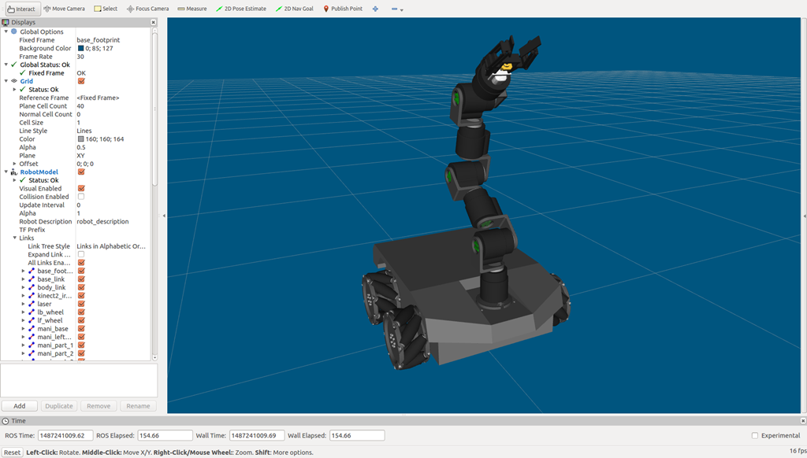

# 玄极2开放源码

## 使用步骤

1. 安装ROS(indigo/Ubuntu 14.04). [安装步骤](http://wiki.ros.org/indigo/Installation/Ubuntu)
2. 配置好开发环境. [配置方法](http://wiki.ros.org/ROS/Tutorials/InstallingandConfiguringROSEnvironment)
3. 安装依赖项:
```
sudo apt-get install ros-indigo-joy
sudo apt-get install ros-indigo-moveit-full
```
4. 获取源码:
```
cd ~/catkin_ws/src/
git clone https://github.com/6-robot/wpm2.git
```
5. 设置设备权限
```
roscd wpm2_bringup
cd scripts
chmod +x create_udev_rules.sh
./create_udev_rules.sh 
```
6. 编译
```
cd ~/catkin_ws
catkin_make
```
7. 欢迎享用 :)

## 平台介绍
玄极2是[北京六部工坊科技有限公司](http://www.6-robot.com)推出的一款专门为移动抓取机器人设计的多关节机械臂，该机械臂具备高集成度、模块化、高智能等特点，不需要额外控制柜，特别适用于安装在移动的机器人底盘上。
### - 高集成度
* 每个关节的驱动电机和控制电路完全集成在关节内部，只需接入电源和总线信号便可独立工作。
* 所有关节采用单电缆串行连接，装配起来后线缆干净整洁。
### - 模块化
* 得益于高集成度设计，每个关节可以独立工作。机械上采用法兰端面输出，安装简单且不存在轴连接的机械间隙。
* 模块化设计使得玄极2可以进行关节数量和组合结构上的任意调整，增加了应用场景的适应性。
### - 高智能
* 每个关节内部集成高端TI的DSP，可快速处理指令信息及反馈的位置扭矩信息。
* 采用数字信号处理分散控制系统，每个自由度的模块内部可单独控制执行机构，可以实现多点位置，速度，加速度，扭矩控制。

## 功能特性

### 1. URDF模型描述
玄极2支持ROS操作系统，具备完整的URDF和SDF模型描述，可以在ROS里直接加载，无缝接入MoveIt!系统。


### 2. 底盘集成
玄极2的每个关节的机械传动和电控系统都完全集成在关节内部，无需再外挂控制柜，可以很方便的安装在运动底盘上。借助ROS的灵活性，软件部分也能迅速的与底盘系统的整合。


### 3. 运动学正反解
玄极2接入ROS后，可Rivz里拖动末端关节，实时解算各关节角度，并以三维模型的形式显示出来。


### 4. 路径规划
为玄极2指定目标姿态后，可进行运动轨迹的路径规划，并在Rviz中实时显示运动轨迹。


### 5. 规划场景设计
在玄极2的规划空间里可根据实际工况动态添加几何模型障碍物，还可以直接加载障碍物的3D模型，使规划任务尽可能符合实际应用的目标场景。


### 6. 碰撞检测
向规划场景里添加障碍物后，ROS会更新玄极2运动空间的环境参数，可以在Rviz里实时查看碰撞区域，玄极2和障碍物的碰撞部分会以红色标示。


### 7. 避碰规划
玄极2可以在添加障碍物后的场景里重新进行路径规划，规划的轨迹会自动避开周围的障碍物。


### 8. 现实场景规划
玄极2的规划空间可以通过RGB-D相机获取现实场景中的障碍物点云，从而生成相应的Octomap地图。玄极2可以在这个障碍物Octomap空间中实时规划路径，引导玄极2的机械臂实体在现实环境中进行动态避障。


